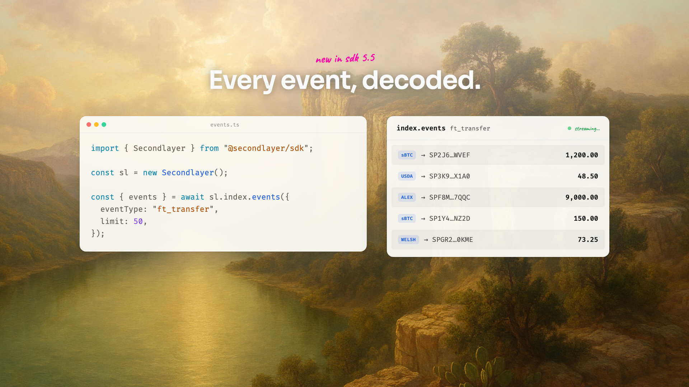
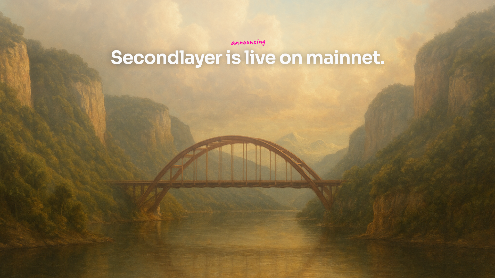

# Cadence

**A changelog video engine that refuses to fabricate your product.**

Point it at a repo or a release and get an on-brand launch / changelog / announcement
video — real code from your project, your colors, rendered locally. No invented APIs,
no generic AI-video look, no hosted service. Free and open source.

> **Ask your agent for a launch video.** With the skill installed, say *"make a
> changelog video for this release"* — it reads your repo, writes the beats, and
> renders an MP4.




→ See the [gallery](docs/gallery.md) for the same engine across themes, formats, and arcs.

## Install

```bash
npx skills add ryanwaits/cadence   # adds the skill to Claude Code / Cursor / Codex
```

Then just ask your agent. Or drive the CLI directly — install the `cadence`
binary globally, or run it with `npx` (no install):

```bash
npm i -g @waits/cadence                                              # a persistent `cadence` binary
cadence create --release owner/name --install "npm i your-pkg"       # a repo → a video
cadence create my.beats.json --format 9x16                           # a beats file → a video
cadence themes                                                       # list built-in themes

npx @waits/cadence create --release owner/name --install "npm i …"   # …or run without installing
```

A render runs entirely on your machine (or your own GitHub Actions) — free, no API key.

→ **New here? Start with the [guides](docs/guides/)** — install, videos, composition, branding, iterate, and CI walkthroughs.

## Why it doesn't look AI-generated

Most AI video either fabricates a fake product or reaches for the same neon-on-black
template. Cadence refuses both:

- **Refuses to invent API.** The agent climbs an honesty ladder — types → examples →
  README → install-only — and never shows a snippet it can't verify in your repo.
- **Refuses a baked-in brand.** Colors and fonts come from *your* theme — derive one
  from your URL (`cadence study --from-url`), a screenshot, or pick from 18 built-ins.
- **Refuses generic backdrops.** The default is a procedural, theme-colored field of
  soft gradient arcs (no asset, no key); an optional pack offers 19th-century landscape
  paintings instead of stock gradients.
- **Refuses freehand animation.** A controlled motion lexicon — ease-out only, no
  bounce — so every video moves the same, considered way.

The whole surface is small and countable: **7 enter + 4 exit transitions, 11 panel
kinds, 3 formats, 18 themes — and one honesty rule: zero invented code.** Beats
**compose**: layout containers (`row`/`col`/`grid`), per-node style overrides, and
data-driven sequencing — all schema-validated, so the agent can extend a video
without inventing anything the engine can't render.

## How it works

A video is a list of **beats** — a small JSON file (`*.beats.json`). Each beat is a
generic unit: an optional background + headline + optional code window + optional
panel — or an explicit `components` tree composing those with layout containers and
per-node style. The engine owns motion, fonts, layout, the typewriter, and code
highlighting, so the same engine makes changelogs, feature drops, launch
announcements, and milestones. The agent (via the skill) writes the beats; you tweak
and render.

Panels visualize what a change *produces* — pick by result:
`feed · data-table · status · stat · proof · stream-resume · fork · upload-progress · diagram · browser · quote`.

- **[docs/guides/](docs/guides/)** — task-oriented walkthroughs (install, videos, composition, branding, iterate, CI).
- **[docs/recipes.md](docs/recipes.md)** — worked examples (changelog, announcement, showcase, brand-from-URL, CI).
- **[docs/gallery.md](docs/gallery.md)** — the same engine, visibly different videos.
- **[WALKTHROUGH.md](WALKTHROUGH.md)** — architecture + how to adjust each part.
- **[MOTION.md](MOTION.md)** — the motion lexicon + taxonomy.

## CLI

```
cadence create <repo|beats.json>   build a video (repo flow, or a beats file)
cadence study  --from-url <url>    a brand URL / color → a theme JSON
cadence audit  <beats.json>        heuristic checks on a beats file (no auto-fix)
cadence redesign <beats.json>      re-skin a beats file (new theme / background)
cadence themes | templates         list built-ins
cadence guide                      interactive walkthrough
```

Shared flags: `--format 16x9|1x1|9x16`, `--theme <name>`, `--theme-file <path>`,
`--frame <n>` (still preview).

## Ship on release (CI)

The included GitHub Action renders a video on every release, free, on your own
runner — no hosted service. See **[docs/github-action.md](docs/github-action.md)**.

## Develop the engine

```bash
bun install
bun run dev          # Remotion Studio
bun run check        # tsc
bun run check:motion # MOTION.md ↔ presets parity
```

Layout: `src/schema` (the beats + composition contract), `src/components` (scene +
`layout/` containers + panels + `registry.ts`), `src/motion` (the lexicon),
`src/theme` (themes + derivation), `src/kinds` (the no-LLM repo→beats arcs),
`src/templates` (the styling layer), `prompts/art` (the optional painterly pack).

## Optional: generated backgrounds

The default backdrop is procedural and needs no key. For custom painted
backdrops, `cadence art` generates them from a freeform prompt — landing in your
project's `.cadence/backgrounds/`, ready to reference as `image:<file>`:

```bash
cadence art --prompt "misty redwood coastline at dawn" --name redwood   # needs OPENAI_API_KEY
cadence art --promote redwood                                           # candidate → backgrounds/
```

Reusable subject sets go in a `--pack <file.json>`; the bundled "Hill Country
Sublime" landscape pack is the default (`cadence art --all`). This is the only
part of the toolchain that calls an external API. See
**[docs/guides/branding-and-formats.md](docs/guides/branding-and-formats.md)** and
**[ART-DIRECTION.md](ART-DIRECTION.md)**.
