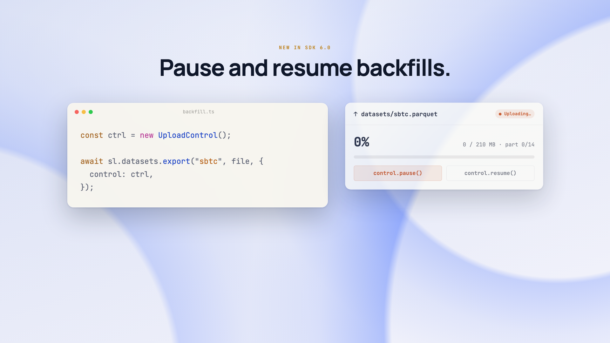
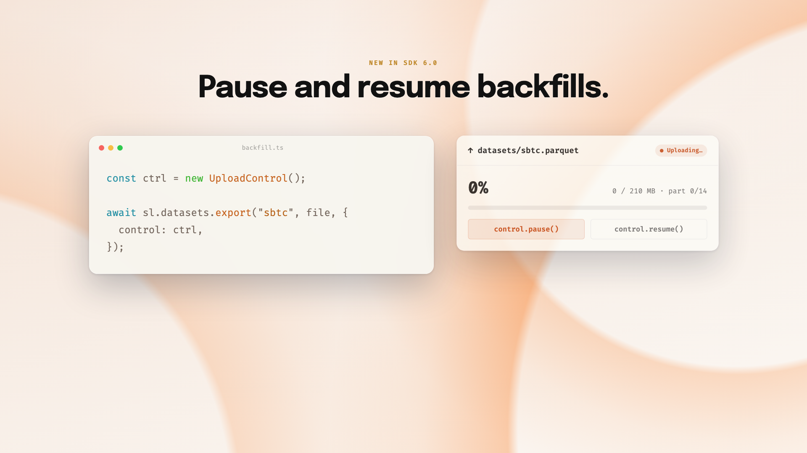
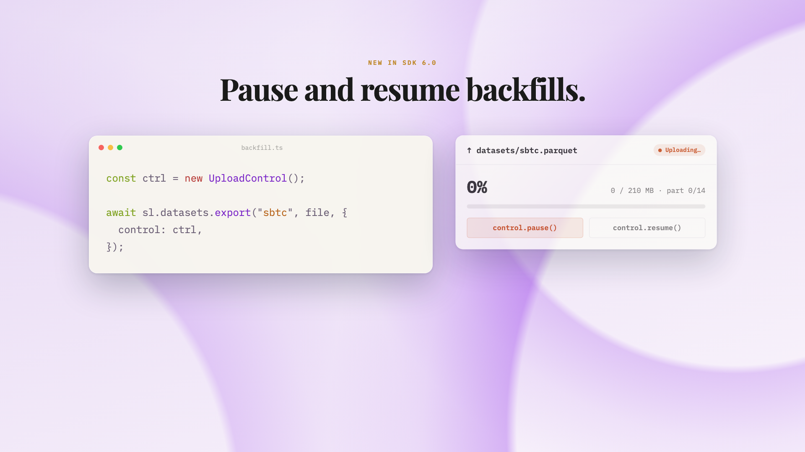
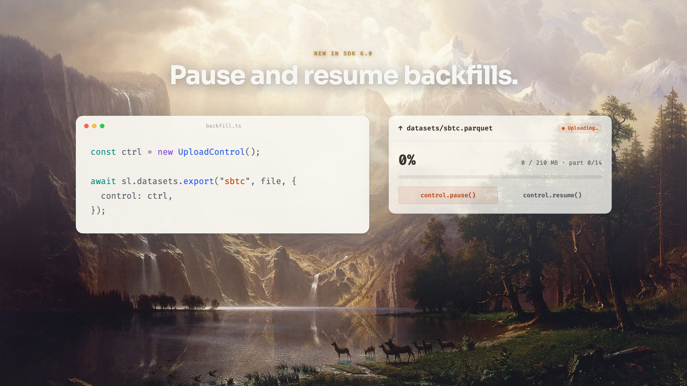

# Gallery

The same engine, the same beats — visibly different videos. Theme changes the
palette, the code colors, *and* the typography; the backdrop is procedural and
theme-colored by default, with an optional painterly pack.

All frames below are one beat (a code window + an upload panel) rendered four ways.

## The procedural default, across themes

No asset, no API key — soft theme-colored gradient arcs. The accent drives the
backdrop, the syntax palette, and the fonts.

| `cobalt` | `sunset` |
|----------|----------|
|  |  |

`editorial` swaps in a serif display face (Playfair) — same engine, different voice:



`cadence themes` lists all 18. Set one with `--theme <name>`, or derive your own
from a brand URL/screenshot with `cadence study`.

## The optional painterly pack

A 19th-century landscape backdrop instead of the procedural field (needs the art
pack; headlines automatically switch to light text on the darker image):



```bash
cadence create <beats> --background image:pennybacker.png
```

---

Recreate any of these:

```bash
cadence redesign <beats> --background shapes --theme sunset --frame 100   # procedural
cadence create   <beats> --theme editorial --frame 100                    # serif theme
```
